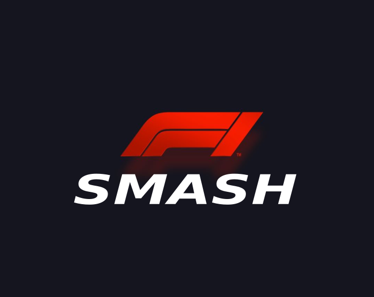

# NAME OF YOUR PROYECT
Smash-f1
## [Play the Game!](https://rubenvillamor.github.io/f1-smashKart/)

# Description

Cansado de ver como en todas las carreras Verstappen queda primero? como le saca mas de medio minuto a los demas?
Cansado de estar esperando año tras año a que F.Alonso no gane su 33 carrera?
Ahora con este juego tienes la posibilidad de ayudarlo. Utiliza las arrow de tu teclado, sortea los coches que van saliendo, los obstaculos
y alcanza a Verstappen y adelántalo para hacerte con la victoria.

# Main Functionalities

- Pulsa el botón start, ponte en la piel de Alonso y controla su coche de F1.
- Sortea los obstaculos que te van saliendo, los coches, y adelantalos a todos.
- Evita la colisión o perderás la partida.
- Aguanta hasta el final, mira tu clasificación, llega hasta Verstappen y hazte con la victoria.
- Por fin habrás ayudado a fernando a hacerse con su 33 victoria.

# Backlog Functionalities

- El bonus con los impactos de las latas todavía no está implementado.
- Añadir niveles que aumenten la dificultad.
- Crear una tienda que te permita adquirir mejoras.
- Crear vidas que, cuando colisiones, te permita seguir pero pierdas posiciones.

# Technologies used

- HTML
- CSS
- JavaScript
- Manipulacion de DOM

# States

- Pantalla inicio 
- Pantalla del juego
- Pantalla final de la derrota 
- Pantalla final de la victoria

# Proyect Structure

- List here sections for your your different JS files.
- One for main.js to manage DOM elements, one for the Game class and one for each other class file of your game.
- Inside each file you can list the functions, clases, properties and methods of your code.

Example:

## main.js
- Variables globales.
- Inicio del juego.
- Instancia del audio.
- function startGame () {}
- Event Listeners.

## Game.js

- class Game () {
    this.alonso = new Alonso
    this.enemyCars = [];
    this.roadDivisors = [];
    this.obstacles = [];
    this.isGameOn = true;
    this.frames = 0;
    this.gameInProgress = true;
    this.verstappenAdded = false;
}
- vehiculoAparece = () => {}
- lineaCarreteraAparece ()
- obstaculoAparece ()
- gameOver ()
- gameWin () 
- colisionConVehiculos ()
- alonsoAdelanta ()
- gameLoop = () => {}

## alonso.js 

- class Alonso {
    constructor () {}
}
- moveDown () {}
- moveUp () {}
- moveRight () {}
- moveLeft () {}

## roaddivisor.js

- class RoadDivisor {
    constructor () {}
    moveDown () {}
}

## obstacle.js 

- class Obstacle {
    constructor () {}
    moveDown () {}
}

## class EnemyCar {
    constructor () {}
    moveDown () {}

}

# Extra Links 

### Slides
[Link](www.your-slides-url-here.com)

## Deploy
[Link](https://rubenvillamor.github.io/f1-smashKart/)